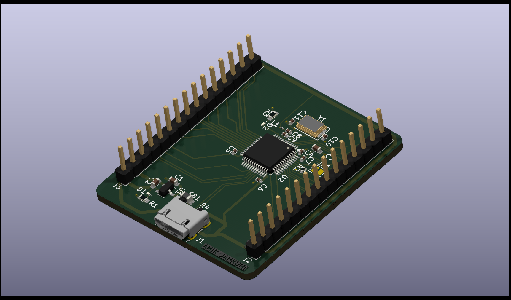

# PCB_Design
Various PCB CAD models developed using KiCad software for educational and personal purposes.
## STM32 PCB Design
This is a custom PCB design for the microcontroller STM32F103C8T6, intended to assist in embedded systems studies. The design was realized from a detailed schematic using KiCad to the design of the PCB layout in a compact way. It provides a solid board on which to perform programming and prototyping with the STM32 processor, among other applications. Much attention was paid to ensuring that the design is easy for beginners to follow while still being highly functional.

## Self-Balancing Robot PCB
This PCB design is tailored for a self-balancing robot. It integrates key components like the L298N motor driver, MPU6050 gyroscope and accelerometer, and an Arduino Nano microcontroller. The layout provides a compact and efficient way to control motors, balancing algorithms, and sensor integration.

### Features:
* Motor Control: L298N driver to manage two DC motors.
* Sensor Input: MPU6050 for real-time balance adjustments.
* Microcontroller: Arduino Nano compatibility for seamless programming and control.
* Power Management: Includes regulators for stable operation.

